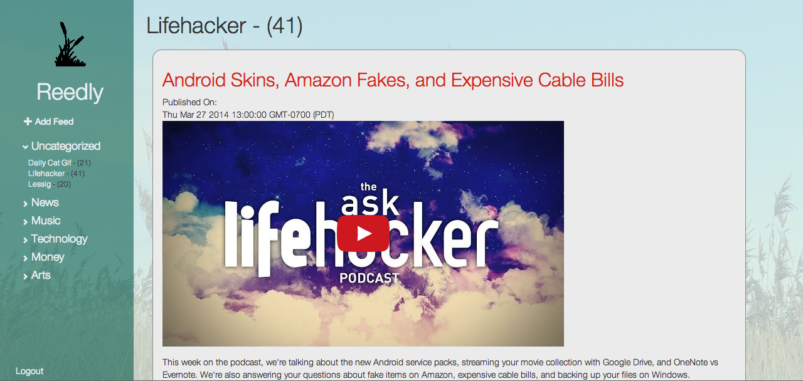
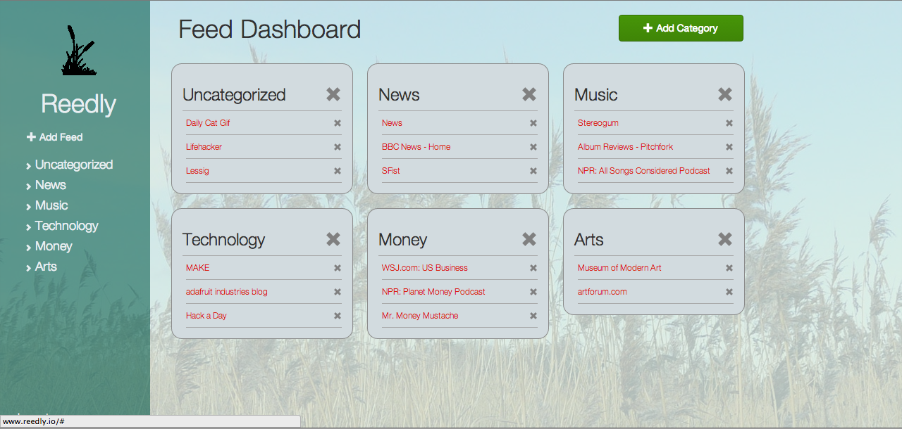

# Reedly 

An open source implementation of a single paged rss reader. A clone of feedly. 

Written Backbone.js and Rails.

**Current Features** 
- Adding Feeds
- Adding Categories for Feeds
- User Accounts

Check it out online at http://www.reedly.io

